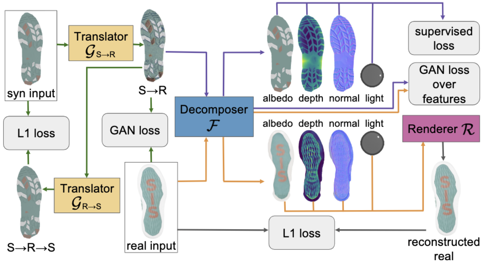

# Creating a Forensic Database of Shoeprints from Online Shoe-Tread Photos

<!-- This repo contains the official Pytorch implementation of: -->

This is the official repo for our paper:

[Creating a Forensic Database of Shoeprints from Online Shoe-Tread Photos](https://arxiv.org/abs/2205.02361)

[Samia Shafique](https://sites.google.com/site/samiashafique067/), [Bailey Kong](https://baileykong.com/), [Shu Kong](http://www.cs.cmu.edu/~shuk/), and [Charless Fowlkes](https://www.ics.uci.edu/~fowlkes/)

WACV 2023
<!-- CVPR 2021 (oral)

For more details, please check our [project website](https://www.ics.uci.edu/~yunhaz5/cvpr2021/cpp.html) -->

### Abstract
Shoe-tread impressions are one of the most common types of evidence left at crime scenes. However, the utility of such evidence is limited by the lack of databases of footwear prints that cover the large and growing number of distinct shoe models. Moreover, the database is preferred to contain the 3D shape, or depth, of shoe-tread photos so as to allow for extracting shoeprints to match a query (crime-scene) print. We propose to address this gap by leveraging shoe-tread photos collected by online retailers. The core challenge is to predict depth maps for these photos. As they do not have ground-truth 3D shapes allowing for training depth predictors, we exploit synthetic data that does. We develop a method, termed ShoeRinsics, that learns to predict depth from fully supervised synthetic data and unsupervised retail image data. In particular, we find domain adaptation and intrinsic image decomposition techniques effectively mitigate the synthetic-real domain gap and yield significantly better depth predictions. To validate our method, we introduce 2 validation sets consisting of shoe-tread image and print pairs and define a benchmarking protocol to quantify the quality of predicted depth. On this benchmark, ShoeRinsics outperforms existing methods of depth prediction and synthetic-to-real domain adaptation.

**Keywords**: Shoeprints, Forensic Evidence, Depth Prediction, Intrinsic Decomposition, and Domain Adaptation 

### Overview 

<p align="center">
    
</p>

Predicting depth for shoe-tread images (collected by online retailers) is the core challenge in constructing a shoeprint database for forensic use. We develop a method termed ShoeRinsics to learn depth predictors. The flowchart depicts how we train ShoeRinsics using annotated synthetic and un-annotated real images. We use domain adaptation (via image translators G<sub>S→R</sub> and G<sub>R→S</sub>) and intrinsic image decomposition (via decomposer F and renderer R) techniques to mitigate synthetic-real domain gaps. Our method achieves significantly better depth prediction on real shoe-tread images than the prior art.


<!-- ### Reference
If you find our work useful in your research please consider citing our paper:
```
@inproceedings{zhao2021camera,
  title={Camera Pose Matters: Improving Depth Prediction by Mitigating Pose Distribution Bias},
  author={Zhao, Yunhan and Kong, Shu and Fowlkes, Charless},
  booktitle={Proceedings of the IEEE/CVF Conference on Computer Vision and Pattern Recognition},
  pages={15759--15768},
  year={2021}
}
```

### Contents
- [Requirments](#requirements)
- [Dataset](#dataset)
- [Training](#training)
- [Evaluation](#evaluation)
- [Pretrained Models](#pretrained-models)


### Requirements
1. Python 3.6 with Ubuntu 16.04
2. Pytorch 1.1.0
3. Apex 0.1 (optional)

You also need other third-party libraries, such as numpy, pillow, torchvision, and tensorboardX (optional) to run the code. We use apex when training all models but it is not strictly required to run the code. 

### Dataset
We use InteriorNet and ScanNet in this project. The detailed data file lists are located in `dataset` folder where each file correspinds to one training/testing distribution (natural, uniform or restricted). Please download and extract the appropriate files before training.
####  Dataset Structure (e.g. interiorNet_training_natural_10800)
```
interiorNet_training_natural_10800
    | rgb
        | rgb0.png
        | ...
    | depth
        | depth0.png
        | ...
    cam_parameter.txt
```
`cam_parameter.txt` contains the intrinsics and camera pose for each sample in the subset. Feel free to sample your own distribution and train with your own data. 

### Training
All training steps use one common `train.py` file so please make sure to comment/uncomment for training with CPP, PDA, or CPP + PDA.
```bash
CUDA_VISIBLE_DEVICES=<GPU IDs> python train.py \
  --data_root=<your absolute path to InteriorNet or ScanNet> \
  --training_set_name=interiorNet_training_natural_10800 \
  --testing_set_name=interiorNet_testing_natural_1080 \
  --batch_size=12 --total_epoch_num=200 --is_train --eval_batch_size=10
```
`batch_size` and `eval_batch_size` are flexible to change given your working environment. Feel free to swap `interiorNet_training_natural_10800` and `interiorNet_testing_natural_1080` to train and test on different distributions.

### Evaluations
Evaluate the final results
```bash
CUDA_VISIBLE_DEVICES=<GPU IDs> python train.py \
  --data_root=<your absolute path to InteriorNet or ScanNet> \
  --training_set_name=interiorNet_training_natural_10800 \
  --testing_set_name=interiorNet_testing_natural_1080 \
  --eval_batch_size=10
``` 
If you want to evaluate with your own data, please create your own testing set with the dataset structure described above.

### Pretrained Models
Pretrained models will be uploaded soon. -->

### Questions
Please feel free to email me at (sshafiqu [at] ics [dot] uci [dot] edu) if you have any questions.
