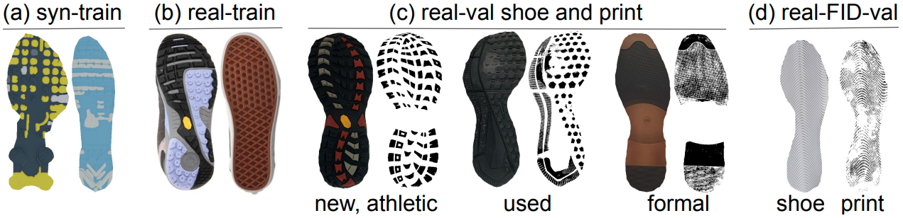

# Creating a Forensic Database of Shoeprints from Online Shoe-Tread Photos

This is the official project page for our paper:

[Creating a Forensic Database of Shoeprints from Online Shoe-Tread Photos](https://arxiv.org/abs/2205.02361)

[Samia Shafique](https://sites.google.com/site/samiashafique067/), [Bailey Kong](https://baileykong.com/), [Shu Kong](http://www.cs.cmu.edu/~shuk/), and [Charless Fowlkes](https://www.ics.uci.edu/~fowlkes/)

[WACV 2023](https://wacv2023.thecvf.com/home)

### Abstract
<p align="justify">
    Shoe-tread impressions are one of the most common types of evidence left at crime scenes. However, the utility of such evidence is limited by the lack of databases of footwear prints that cover the large and growing number of distinct shoe models. Moreover, the database is preferred to contain the 3D shape, or depth, of shoe-tread photos so as to allow for extracting shoeprints to match a query (crime-scene) print. We propose to address this gap by leveraging shoe-tread photos collected by online retailers. The core challenge is to predict depth maps for these photos. As they do not have ground-truth 3D shapes allowing for training depth predictors, we exploit synthetic data that does. We develop a method, termed ShoeRinsics, that learns to predict depth from fully supervised synthetic data and unsupervised retail image data. In particular, we find domain adaptation and intrinsic image decomposition techniques effectively mitigate the synthetic-real domain gap and yield significantly better depth predictions. To validate our method, we introduce 2 validation sets consisting of shoe-tread image and print pairs and define a benchmarking protocol to quantify the quality of predicted depth. On this benchmark, ShoeRinsics outperforms existing methods of depth prediction and synthetic-to-real domain adaptation.
</p>

**Keywords**: Shoeprints, Forensic Evidence, Depth Prediction, Intrinsic Decomposition, and Domain Adaptation 

### Overview 

<p align="center">
    
</p>

<p align="justify">
    Predicting depth for shoe-tread images (collected by online retailers) is the core challenge in constructing a shoeprint database for forensic use. We develop a method termed ShoeRinsics to learn depth predictors. The flowchart depicts how we train ShoeRinsics using annotated synthetic and un-annotated real images. We use domain adaptation (via image translators G<sub>S→R</sub> and G<sub>R→S</sub>) and intrinsic image decomposition (via decomposer F and renderer R) techniques to mitigate synthetic-real domain gaps. Our method achieves significantly better depth prediction on real shoe-tread images than the prior art.
</p>

### Datasets

<p align="center">
    
</p>

<p align="justify">
    We introduce 2 training datasets (<i>syn-train</i> and <i>real-train</i>) 
    and 2 validation datasets (<i>real-val</i> and <i>real-FID-val</i>) in this work. 
    The figure above shown example shoe-treads from each dataset. 
    Note that to analyze the models’ robustness to novel shoe types, we constrain our
    training sets to contain only brand-new athletic shoes while 
    letting real-val also include formal and used (worn) shoes.
</p>

The details and download links of each dataset are as follows:

1. <b>Syn-train</b>:
Our synthetic dataset (<i>syn-train</i>) contains synthetic shoe-tread images and their 
intrinsic annotations (depth, albedo, normal, and lighting). 
We synthesize a shoe-tread image with a given depth map, an albedo map, and a lighting environment. 
We pass these to a physically-based rendering engine (Mitsuba) to generate the synthetic image. 
The final syn-train set contains 88,408 shoe-treads with paired ground-truth intrinsic images.
[Download](https://drive.google.com/drive/folders/1nLog4COnTn1ZejaHuEZG2ZXr4JlMrG7-?usp=share_link)

2. <b>Real-train</b>: Online retailers adopt photos of shoes for advertisement, 
which include shoe-tread images. <i>Real-train</i> consists of 3,543 such shoe-tread images 
and their masks (computed by a simple network to segment out the shoe-treads). 
This dataset does not contain any ground-truth and consists only of new, athletic shoes.
[Download](https://drive.google.com/drive/folders/12zoVAyfyymA3jINW8ATJ9Zx_D8YHPnOo?usp=share_link)

3. <b>Real-val</b>: This dataset contains a total of 36 sets of shoe-tread images, ground-truth shoeprints, and masks. 
We create this dataset by collecting shoes, photographing them, and collecting their prints using the <i>block printing technique</i>. 
There are 3 different shoe categories present in this dataset - 22 new-athletic, 6 new-formal, and 8 used-athletic.
Further details are provided in the README file. 
[Download](https://drive.google.com/drive/folders/1-QW6MlNnxV3FHjlM68eyRGzAn39AX1ZR?usp=share_link)

4. <b>Real-FID-val</b>: This dataset contains 41 sets of shoe-tread images, shoeprints, and masks.
Note that the shoeprints in this dataset come from the [FID300](https://fid.dmi.unibas.ch/) dataset 
while the shoe-tread images are separately downloaded from online retailers 
(i.e., these images are disjoint from those in the real-train set). 
We find matched FID300 prints (used as the ground-truth) and the downloaded shoe-tread images,
and align them manually. Real-FID-val contains 41 new, athletic shoe-tread images with 
corresponding ground-truth shoeprints and masks to segment out the shoe-treads.
[Download](https://drive.google.com/drive/folders/1feHRI1_wErloXhmDpbTiorUaOwS6J5IO?usp=share_link)

You can view and download all the datasets together [here](https://drive.google.com/drive/folders/1VkCTC9CS4VZ7z1Vt7WKBwSNUCxXlGmCv?usp=share_link).

### Pretrained Models
Our pretrained model is available for download [here](https://drive.google.com/file/d/1XQGoIZfieuRd891eqpaw0-_fD7PxVFXH/view?usp=share_link). 
We additionally provide pretrained versions of our supporting models 
([translator](https://drive.google.com/file/d/18NhGoKIFcFY4mrP86chSdvCNtrjeFySD/view?usp=share_link), 
[renderer](https://drive.google.com/file/d/1Jxueslah8HPGXq3Kgt7KYy0RXskbZso5/view?usp=share_link)).
All pretrained models can be downloaded together [here](https://drive.google.com/drive/folders/1C4Odv49cczOdqwRLZGDOSOnUCCD0zcJx?usp=share_link).

### Testing

Use the following command to generate predictions using our pretrained model 
and test them with our proposed metric:
```
test.py --weights_decomposer=../models/decomposer_best_state.t7    --dataroot=../data/     --val_dataset_dir=real_val
```
<p align="justify">
    Note that weights_decomposer should specify the path to the pretrained model. 
    Dataroot should specify the path to the root directory which holds all datasets used in the experiments.
    Val_dataset_dir should name the directory for the validation dataset used (real_val or real_FID_val).
</p>

You can download our predictions on real-val and real-FID-val [here](https://drive.google.com/drive/folders/1koeAF1iKp_fjviEaD0UvbYRb2Yx8TPnF?usp=share_link).

### Training

<p align="justify">
    We train our network in stages. We outline each step below. 
    Note that paths should be set appropriately. 
    Dataroot specifies the path to the root directory containing datasets. 
    Syn_train_dataset_dir and real_train_dataset_dir are the names of the synthetic and real training dataset directories.
    Weights_translator, weights_renderer, and weights_decomposer should specify path to corresponding saved models.
</p>

1. Train the decomposer with synthetic data.
```
python train.py  --dataroot=../data/ --syn_train_dataset_dir=syn_train --real_train_dataset_dir=real_train  --train_net
```

2. Train the renderer with synthetic data.
```
python train.py     --dataroot=../data/  --syn_train_dataset_dir=syn_train --real_train_dataset_dir=real_train  --train_renderer
```

3. Train the translator using code from 
[CycleGAN's official release](https://github.com/junyanz/pytorch-CycleGAN-and-pix2pix).
Our pretrained translator can be downloaded 
[here](https://drive.google.com/file/d/18NhGoKIFcFY4mrP86chSdvCNtrjeFySD/view?usp=share_link).


4. Finetune the renderer with translated synthetic data.
```
python train.py  --dataroot=../data/  --weights_translator=../models/translator_best_state.t7   --weights_renderer=../models/renderer_best_state.t7  --syn_train_dataset_dir=syn_train --real_train_dataset_dir=real_train  --train_renderer
```

5. Finetune the decomposer using the full pipeline.
```
python train.py  --weights_decomposer=../models/decomposer_best_state.t7       --dataroot=../data/  --weights_translator=../models/translator_best_state.t7   --weights_renderer=../models/renderer_best_state.t7  --syn_train_dataset_dir=syn_train --real_train_dataset_dir=real_train  --train_discriminator --train_net
```


### Reference
If you find our work useful in your research, please consider citing our paper:
```
@misc{https://doi.org/10.48550/arxiv.2205.02361,
  doi = {10.48550/ARXIV.2205.02361},
  url = {https://arxiv.org/abs/2205.02361},
  author = {Shafique, Samia and Kong, Bailey and Kong, Shu and Fowlkes, Charless C.},
  keywords = {Computer Vision and Pattern Recognition (cs.CV), FOS: Computer and information sciences, FOS: Computer and information sciences},
  title = {Creating a Forensic Database of Shoeprints from Online Shoe Tread Photos},
  publisher = {arXiv},
  year = {2022},
  copyright = {arXiv.org perpetual, non-exclusive license}
}
```


### Questions
Please feel free to email me at (sshafiqu [at] ics [dot] uci [dot] edu) if you have any questions.

### Acknowledgements
This work was funded (or partially funded) by the Center for Statistics and Applications in Forensic Evidence (CSAFE) through Cooperative Agreements 70NANB15H176 and 70NANB20H019 between NIST and Iowa State University, which includes activities carried out at Carnegie Mellon University, Duke University, University of California Irvine, University of Virginia, West Virginia University, University of Pennsylvania, Swarthmore College and University of Nebraska, Lincoln.